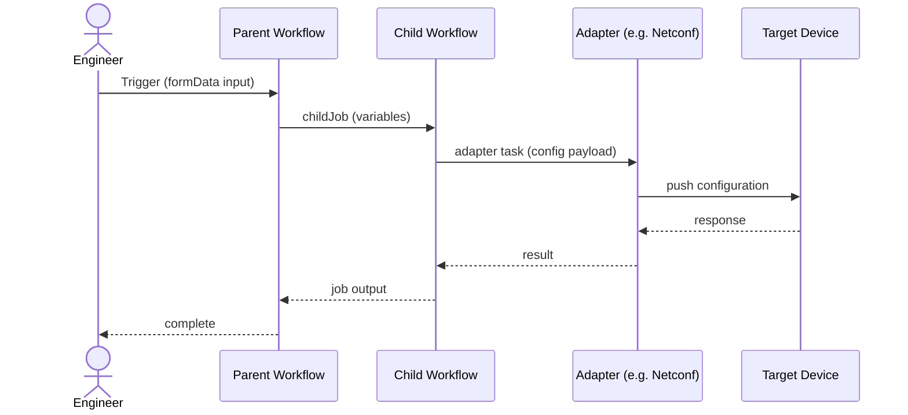

## Interaction Modes

**1. Deliver from Spec**
Start with a use case, refine it into a requirements spec, assess the platform, design the solution, build it, and record what was delivered. Use this when you are delivering automation end-to-end with full traceability.

**2. FlowAgent to Spec**
Take an existing FlowAgent, read what it did across its missions, and produce a deterministic workflow spec that captures the same logic without an LLM in the execution path. Use this when an agent has proven a pattern and you want to productionize it as a structured workflow.

**3. Generate Spec from Project**
Take an existing project, analyze what was built, and extract the requirements spec and solution design that should exist alongside it. Use this when automation is already running but the formal documentation is missing.

**4. Explore**
Connect to a platform, see what is available, and build freely without following a delivery lifecycle. Use this when you want to investigate, experiment, or build something without committing to a spec.

---

```
Four interaction modes — pick the one you need.

 ┌──────────────────────────────────────────────────────────────────────────────────┐
 │  1. DELIVER FROM SPEC                                                            │
 │                                                                                  │
 │  /spec-agent              Pick a spec, fork, refine, engineer approves           │
 │                           → customer-spec.md locked                             │
 │                                                                                  │
 │  /solution-arch-agent     Auth + pull platform data          ← first API call   │
 │                           Assess capabilities, check adapters, find reuse       │
 │                           Engineer approves → feasibility.md locked             │
 │                           Component inventory, adapter mappings, build plan     │
 │                           Engineer approves → solution-design.md locked         │
 │                                                                                  │
 │  /builder-agent           Build all assets, test each component, deliver        │
 │                           Record delivered state, deviations, learnings         │
 │                           Engineer signs off → as-built.md                      │
 └──────────────────────────────────────────────────────────────────────────────────┘

 ┌──────────────────────────────────────────────────────────────────────────────────┐
 │  2. FLOWAGENT TO SPEC                                                            │
 │                                                                                  │
 │  /flowagent-to-spec       Read agent config + mission history                   │
 │                           Map tool call patterns to deterministic workflow       │
 │                           → customer-spec.md (deterministic equivalent)         │
 │                                                                                  │
 │  Then continue with Deliver from Spec → /solution-arch-agent → /builder-agent  │
 └──────────────────────────────────────────────────────────────────────────────────┘

 ┌──────────────────────────────────────────────────────────────────────────────────┐
 │  3. GENERATE SPEC FROM PROJECT                                                   │
 │                                                                                  │
 │  /project-to-spec         Read all project components                           │
 │                           Analyze tasks, adapters, transitions, data flows      │
 │                           → customer-spec.md + solution-design.md              │
 └──────────────────────────────────────────────────────────────────────────────────┘

 ┌──────────────────────────────────────────────────────────────────────────────────┐
 │  4. EXPLORE                                                                      │
 │                                                                                  │
 │  /explore                 Auth, pull platform data, summarize environment       │
 │                           Use skills freely — no delivery lifecycle             │
 │                           /builder-agent  /itential-devices  /iag               │
 │                           /flowagent  /itential-golden-config  /itential-lcm    │
 └──────────────────────────────────────────────────────────────────────────────────┘
```

---

## Design Principles

Requirements defines what is needed.
Feasibility confirms what the platform can support.
Design defines how the solution will be delivered.
Build implements the approved design.
As-Built records what was actually delivered and what changed.

### Core Rules

1. **Each skill owns one stage.** `/explore` = freeform. `/spec-agent` = requirements. `/solution-arch-agent` = feasibility + design. `/builder-agent` = build + as-built.

2. **Approvals gate each transition.** Engineer approves `customer-spec.md` before feasibility. Engineer approves `feasibility.md` before design. Engineer approves `solution-design.md` before build.

3. **Pull late.** Platform data is pulled only after requirements are locked. Early pulls are wasted when scope changes.

4. **Handoffs are artifact-based.** Skills pass files, not verbal summaries.

5. **Builder does not reinterpret.** Once design is approved, `/builder-agent` executes the plan. If a file is missing, that's an upstream failure.

---

## Artifact Progression

```
spec-files/spec-*.md              Generic library spec (never modified)
        │
        │  /spec-agent: fork + refine
        ▼
{use-case}/customer-spec.md       HLD — approved
        │
        │  /solution-arch-agent: assess platform
        ▼
{use-case}/feasibility.md         Feasibility assessment — approved
        │
        │  /solution-arch-agent: design
        ▼
{use-case}/solution-design.md     Solution Design / LLD — approved
        │                         (includes ## Sequence Diagram)
{use-case}/diagrams/              Architecture diagram — optional draw.io
        │
        │  /builder-agent: build
        ▼
{use-case}/assets/                Delivered assets
        │
        │  /builder-agent: record
        ▼
{use-case}/as-built.md            Delivered state, deviations, learnings
                                  + ## As-Built appended to solution-design.md
                                  + ## Amendments appended to customer-spec.md (if scope changed)
```

On rebuild: start from the reconciled artifacts — amended spec and as-built design are the new baseline.

---

## Data Classification

| File | Pulled by | When |
|------|-----------|------|
| `openapi.json` | `/explore` or `/solution-arch-agent` | Explore: immediately. Delivery: during Feasibility. |
| `tasks.json` | same | same |
| `apps.json` | same | same |
| `adapters.json` | same | same |
| `applications.json` | same | same |
| `devices.json` | `/solution-arch-agent` | During Feasibility (if spec involves devices) |
| `workflows.json` | `/solution-arch-agent` | During Feasibility (if reuse is possible) |

---

## Solution Design — Required Diagrams

The solution design stage produces two diagrams alongside `solution-design.md`. Both are required before the engineer approves the design and build begins.

### Sequence Diagram (Mermaid — embedded in `solution-design.md`)

A Mermaid sequence diagram is embedded directly in `solution-design.md` under a `## Sequence Diagram` heading. It shows the runtime flow: what triggers the automation, which workflows are called, which adapter tasks execute, what data is passed, and how errors are handled.

**Minimum elements to include:**
- Trigger (API call, schedule, UI form submission)
- Parent workflow and any child workflows (childJob tasks)
- Each adapter task with the target system it calls
- Key data passed between steps (job variables, task outputs)
- Error paths and terminal states

**Example structure:**



### Architecture Diagram (draw.io — optional)

A draw.io file at `{use-case}/diagrams/solution-architecture.drawio` provides a visual topology of the solution: platform components, adapter connections, and target systems. This is optional but recommended for complex solutions with multiple adapters or integrations.

Reference it in `solution-design.md` under a `## Architecture Diagram` heading:

```markdown
## Architecture Diagram

See [diagrams/solution-architecture.drawio](diagrams/solution-architecture.drawio).
```

### Artifact Placement

```
{use-case}/
  customer-spec.md
  feasibility.md
  solution-design.md        ← includes ## Sequence Diagram (Mermaid)
  diagrams/
    solution-architecture.drawio   ← optional
  assets/
  as-built.md
```

---

## Roles by Stage

| Stage | PM | Solution Architect | Infrastructure SME | Platform Engineer | QA | Product Owner |
|-------|----|--------------------|---------------------|-------------------|----|---------------|
| **Requirements** | Facilitates, manages timeline | Translates business need into spec | Validates technical feasibility | — | Reviews acceptance criteria | Defines business need |
| **Feasibility** | — | Guides discovery priorities | Provides environment context | Runs discovery, maps capabilities | — | — |
| **Design** | Reviews for timeline impact | Produces solution design | Validates device/protocol assumptions | Confirms platform capabilities | Plans test strategy | — |
| **Build** | Tracks progress | Available for clarification | Available for infrastructure questions | Builds and tests | Validates components | — |
| **As-Built** | Reviews actuals | Reviews deviations for future patterns | Reviews infrastructure findings | Documents deviations | Validates final delivery | Acknowledges scope amendments |
